<p align="center">
  <picture>
    <source media="(prefers-color-scheme: light)" srcset="assets/hero-light.svg">
    
  </picture>
</p>

<p align="center">
  <b>21 interactive frontend projects</b> built with <b>vanilla HTML, CSS and JavaScript</b> — no frameworks, no build tools.<br/>
  Every project is complete, responsive, keyboard-accessible and error-handled.
</p>

<p align="center">
  <a href="https://Rishp-3.github.io/21-Frontend-Peroject/"></a>
  
  
  
  
  
</p>

---

## 📚 Projects

<p align="center">
  <picture>
    <source media="(prefers-color-scheme: light)" srcset="assets/projects-light.svg">
    
  </picture>
</p>

|  #  | Project                                             | What it does                                                          |                                       Live                                       |
| :-: | :-------------------------------------------------- | :-------------------------------------------------------------------- | :------------------------------------------------------------------------------: |
| 01  | [Calculator](./calculator)                          | Arithmetic calculator with keyboard support & chained operators       |       [▶ Demo](https://Rishp-3.github.io/21-Frontend-Peroject/calculator/)       |
| 02  | [To-Do List](./to-do-list)                          | Task manager with localStorage persistence (XSS-safe)                 |       [▶ Demo](https://Rishp-3.github.io/21-Frontend-Peroject/to-do-list/)       |
| 03  | [Digital Clock](./digital-clock)                    | Real-time clock with 12/24h and timezone selector (Intl)              |     [▶ Demo](https://Rishp-3.github.io/21-Frontend-Peroject/digital-clock/)      |
| 04  | [Number Guessing Game](./number-guessing-game)      | Guess 1–100 with hot/cold hints and stats                             |  [▶ Demo](https://Rishp-3.github.io/21-Frontend-Peroject/number-guessing-game/)  |
| 05  | [Counter App](./counter-app)                        | Increment/decrement/reset with highest & total-clicks tracking        |      [▶ Demo](https://Rishp-3.github.io/21-Frontend-Peroject/counter-app/)       |
| 06  | [Random Quote Generator](./random-quote-generator)  | Quotes from DummyJSON API with loading/error states                   | [▶ Demo](https://Rishp-3.github.io/21-Frontend-Peroject/random-quote-generator/) |
| 07  | [Color Generator](./color-generator)                | Random colors, HEX/RGB/HSL/CMYK, copy buttons, recents                |    [▶ Demo](https://Rishp-3.github.io/21-Frontend-Peroject/color-generator/)     |
| 08  | [Weather App \*](./weather-app)                     | Current weather + 5-day forecast (OpenWeather, bring your own key)    |      [▶ Demo](https://Rishp-3.github.io/21-Frontend-Peroject/weather-app/)       |
| 09  | [Stopwatch](./stopwatch-timer)                      | Stopwatch with lap tracking and best/worst highlighting               |    [▶ Demo](https://Rishp-3.github.io/21-Frontend-Peroject/stopwatch-timer/)     |
| 10  | [Form Validation](./form-validation)                | Client-side validation, Unicode names, password strength & toggle     |    [▶ Demo](https://Rishp-3.github.io/21-Frontend-Peroject/form-validation/)     |
| 11  | [Image Slider](./image-slider)                      | Carousel with autoplay, swipe, drag, reduced-motion support           |      [▶ Demo](https://Rishp-3.github.io/21-Frontend-Peroject/image-slider/)      |
| 12  | [Quiz App](./quiz-app)                              | Timed quiz, shuffled questions/options, best score saved              |        [▶ Demo](https://Rishp-3.github.io/21-Frontend-Peroject/quiz-app/)        |
| 13  | [Password Generator](./password-generator)          | Crypto-random passwords, strength meter, history                      |   [▶ Demo](https://Rishp-3.github.io/21-Frontend-Peroject/password-generator/)   |
| 14  | [Notes App](./notes-app)                            | CRUD notes with search highlighting, color labels, localStorage       |       [▶ Demo](https://Rishp-3.github.io/21-Frontend-Peroject/notes-app/)        |
| 15  | [Expense Tracker](./expense-tracker)                | Income/expense with categories, multi-currency, edit, breakdown bars  |    [▶ Demo](https://Rishp-3.github.io/21-Frontend-Peroject/expense-tracker/)     |
| 16  | [Movie Search \*](./movie-search-app)               | OMDb search with debounce, race-safe requests, detail modal           |    [▶ Demo](https://Rishp-3.github.io/21-Frontend-Peroject/movie-search-app/)    |
| 17  | [Chat UI](./chat-ui)                                | Frontend-only messenger: conversations, typing indicator, persistence |        [▶ Demo](https://Rishp-3.github.io/21-Frontend-Peroject/chat-ui/)         |
| 18  | [Music Player](./music-player)                      | Tracks synthesized with Web Audio, playlist, shuffle/repeat           |      [▶ Demo](https://Rishp-3.github.io/21-Frontend-Peroject/music-player/)      |
| 19  | [E-commerce Product Page](./ecommerce-product-page) | Variants, gallery, cart drawer, checkout summary, reviews             | [▶ Demo](https://Rishp-3.github.io/21-Frontend-Peroject/ecommerce-product-page/) |
| 20  | [Typing Speed Test](./typing-speed-test)            | WPM/CPM/accuracy with keystroke tracking, per-duration bests          |   [▶ Demo](https://Rishp-3.github.io/21-Frontend-Peroject/typing-speed-test/)    |
| 21  | [Rock Paper Scissors](./rock-paper-scissors)        | Match play vs adaptive CPU, streaks, lifetime wins                    |  [▶ Demo](https://Rishp-3.github.io/21-Frontend-Peroject/rock-paper-scissors/)   |

\* Projects 08 and 16 need **your own free API key** — see [API keys](#-api-keys).

---

## 📊 Progress

<p align="center">
  <picture>
    <source media="(prefers-color-scheme: light)" srcset="assets/progress-light.svg">
    
  </picture>
</p>

---

## 🛠️ Tech stack

<p align="center">
  <picture>
    <source media="(prefers-color-scheme: light)" srcset="assets/tech-light.svg">
    
  </picture>
</p>

- **HTML5** — semantic structure, ARIA where needed
- **CSS3** — Flexbox, Grid, `clamp()`, media queries, `:focus-visible`
- **JavaScript (ES6+)** — no libraries; Local Storage, Fetch, Web Audio, Clipboard, Intl APIs

---

## 🚦 Getting started

```bash
git clone https://github.com/Rishp-3/21-Frontend-Peroject.git
cd 21-Frontend-Peroject
python3 -m http.server 8000     # then visit http://localhost:8000 (landing page)
```

Or just open any `<project>/index.html` in a browser. In VS Code: right-click → **Open with Live Server**.

### 🔑 API keys

Projects **08 (Weather)** and **16 (Movie Search)** need a free key:

1. Copy `config.example.js` to `config.js` inside the project folder.
2. Paste your own key. `config.js` is gitignored, so it never gets committed.

---

## 📁 Project structure

```text
21-Frontend-Peroject/
├── index.html                   # landing page linking all 21 projects
├── .github/workflows/pages.yml  # auto-deploy to GitHub Pages
├── assets/                      # README graphics (SVG, dark + light)
├── 01-calculator/
│   ├── index.html
│   ├── style.css
│   ├── main.js
│   └── README.md
├── 02-to-do-list/ … 21-rock-paper-scissors/   # same layout for every project
├── .gitignore
├── LICENSE
└── README.md
```

---

## ⚠️ Security note

Two API keys were previously hardcoded and are still visible in this repository's **git history**. They were removed from the code, but the keys themselves must be **regenerated or revoked**:

- OpenWeather account → regenerate the key used by project 08
- OMDb account → regenerate the key used by project 16

---

## 👤 Author

**Rishabh Pal** — frontend developer, self-taught, working towards full stack.

<p align="center">
  <a href="https://github.com/Rishp-3">GitHub</a> ·
  <a href="https://linkedin.com/in/rishp3">LinkedIn</a> ·
  <a href="https://x.com/rishp_3">X</a> ·
  <a href="https://instagram.com/rishp_3">Instagram</a> ·
  <a href="https://youtube.com/@rishp3">YouTube</a> ·
  <a href="https://codepen.io/Rishp-3">CodePen</a> ·
  <a href="https://medium.com/@rishp-3">Medium</a> ·
  <a href="mailto:rp6229553@gmail.com">Email</a>
</p>

## 📄 License

[MIT](./LICENSE)

---

<p align="center"><b>🚀 Happy coding! &nbsp;Build → Practice → Improve → Repeat.</b></p>
