## 👤 Author

  <picture>
    <source media="(prefers-color-scheme: light)" srcset="author-light.svg">
    
  </picture>

  <a href="https://github.com/Rishp-3"><picture><source media="(prefers-color-scheme: light)" srcset="chips/github-light.svg"></picture></a>
  <a href="https://linkedin.com/in/rishp3"><picture><source media="(prefers-color-scheme: light)" srcset="chips/linkedin-light.svg"></picture></a>
  <a href="https://x.com/rishp_3"><picture><source media="(prefers-color-scheme: light)" srcset="chips/x-light.svg"></picture></a>
  <a href="https://instagram.com/rishp_3"><picture><source media="(prefers-color-scheme: light)" srcset="chips/instagram-light.svg"></picture></a>
  <a href="https://leetcode.com/u/rishp_3/"><picture><source media="(prefers-color-scheme: light)" srcset="chips/leetcode-light.svg"></picture></a>
  <a href="https://www.geeksforgeeks.org/profile/rishp_3"><picture><source media="(prefers-color-scheme: light)" srcset="chips/geeksforgeeks-light.svg"></picture></a>
  <!-- Add your email: replace YOUR_EMAIL_HERE, then uncomment
  <a href="mailto:YOUR_EMAIL_HERE"><picture><source media="(prefers-color-scheme: light)" srcset="chips/email-light.svg"></picture></a>
  -->

